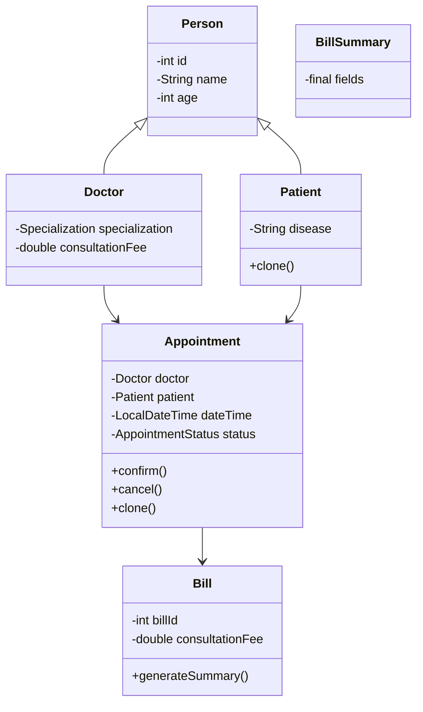

# MediTrack: Healthcare & Appointment Management System

MediTrack is a console-based Core Java project designed to manage Doctors, Patients, Appointments, and Billing operations using strong Object-Oriented Design principles.

The project demonstrates practical implementation of:

- Core OOP concepts
- Design Patterns (Singleton)
- Generics
- Enums
- Exception Handling
- Java Streams
- File I/O (CSV Persistence)
- Immutable Design
- Layered Architecture

---

## 1. Features

### Doctor Management
- Add Doctor
- View All Doctors
- Search Doctor by ID
- Filter by Specialization

### Patient Management
- Add Patient
- View All Patients
- Search Patient by ID or Name
- Clone Patient Object (Deep Copy Demonstration)

### Appointment Management
- Book Appointment
- Confirm Appointment
- Cancel Appointment
- View All Appointments
- Filter by Appointment Status

### Billing System
- Generate Bill for Appointment
- Automatic Tax Calculation
- Immutable Bill Summary

### Persistence
- Save Patients to CSV
- Load Patients using `--loadData`
- Automatic Save on Exit

---

## 2. Tech Used

- Java 25 (Compatible with Java 17+)
- Maven
- ArrayList & HashMap
- Java Streams API
- Custom Exceptions
- Console-based UI

---

## 3. Project Structure

```
MediTrack/
│
├── src/main/java/com/airtribe/meditrack
│   ├── entity
│   │   ├── Person (abstract)
│   │   ├── Doctor
│   │   ├── Patient
│   │   ├── Appointment
│   │   ├── Bill
│   │   └── BillSummary (immutable)
│   │
│   ├── service
│   │   ├── DoctorService
│   │   ├── PatientService
│   │   └── AppointmentService
│   │
│   ├── util
│   │   ├── Validator
│   │   ├── CSVUtil
│   │   ├── IdGenerator (Singleton)
│   │   └── DataStore<T> (Generic)
│   │
│   ├── interfaces
│   │   ├── Searchable<T>
│   │   └── Payable
│   │
│   ├── exception
│   │   ├── AppointmentNotFoundException
│   │   └── InvalidDataException
│   │
│   └── Main (Console UI)
│
├── test
│   └── TestRunner
│
└── docs
    ├── Setup_Instructions.md
    ├── JVM_Report.md
    └── Design_Decisions.md
```

---

## 4. OOP & Implementation Mapping

| Concept            | Where Used                                      |
|--------------------|-------------------------------------------------|
| Encapsulation      | Private fields + controlled setters in entities |
| Inheritance        | `Doctor` and `Patient` extend `Person`          |
| Polymorphism       | `Searchable<T>` interface & dynamic dispatch    |
| Abstraction        | Service Layer & Interfaces                      |
| Singleton          | `IdGenerator` ensures unique IDs                |
| Generics           | `DataStore<T>` reusable storage                 |
| Enum               | `Specialization`, `AppointmentStatus`           |
| Immutable Object   | `BillSummary`                                   |
| Exception Handling | Custom exceptions in service layer              |
| Streams API        | Filtering & searching operations                |
| Deep Copy          | `clone()` in Patient & Appointment              |

---

## 5. How to Run the Project

### Step 1: Open in IntelliJ

- Open IntelliJ IDEA
- Click **Open**
- Select the `meditrack` folder

### Step 2: Configure JDK

- Go to File → Project Structure
- Set SDK to Java 17+ (Tested on Java 25)

### Step 3: Run Application

Navigate to:

```
src/main/java/com/airtribe/meditrack/Main.java
```

Right-click → Run

---

## 6. Optional CSV Load

To load previously saved patient data:

Run with program argument:

```
--loadData
```

Patient data is saved automatically when exiting (Option 0).

---

## 7. UML Class Diagram



---

## 8. Design Highlights

- Clean layered architecture (Entity → Service → Util → UI)
- Singleton pattern for controlled ID generation
- Generic reusable storage
- Immutable billing summary
- Enum-based type safety
- Stream-based filtering
- Centralized validation logic
- Deep object cloning demonstration

---

## 9. Sample Console Output

```
===== MENU =====
1. Add Doctor
2. Add Patient
3. Book Appointment
4. View Appointments
5. Generate Bill
0. Exit
```

Example Bill Output:

```
BillSummary{billId=1, patient='Test Patient', doctor='Dr. Sharma',
consultationFee=800.0, totalAmount=944.0}
```

---

## 10. Documentation

Detailed explanations available in:

- Setup_Instructions.md
- Design_Decisions.md
- JVM_Report.md


